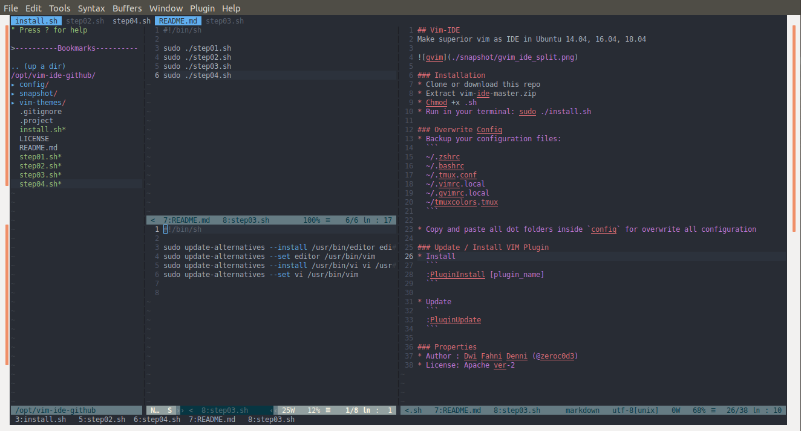

## Vim-IDE
Make superior vim as IDE in Ubuntu 14.04, 16.04, 18.04



### Installation
* Clone or download this repo
* Extract vim-ide-master.zip
* Chmod +x *.sh
* Run in your terminal: sudo ./install.sh

### Overwrite Config
* Backup your configuration files:
  ```
  ~/.zshrc
  ~/.bashrc
  ~/.tmux.conf
  ~/.vimrc.local
  ~/.gvimrc.local
  ~/tmuxcolors.tmux
  ```

* Copy and paste all dot folders inside `config` for overwrite all configuration

### Update / Install VIM Plugin
* Install
  ```
  :PluginInstall [plugin_name]
  ```

* Update
  ```
  :PluginUpdate
  ```

### Properties
* Author : **Dwi Fahni Denni (@zeroc0d3)**
* License: **Apache ver-2**
